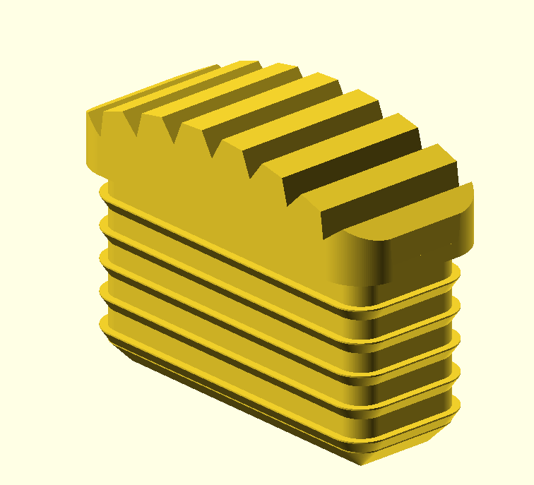

# Ladder Foot

A OpenSCAD design for a ladder foot.

The feet of our kwikkie ladder broke and we couldn't find spares for them.

A search on thingiverse resulted in 2 interesting hits:

- https://www.thingiverse.com/thing:4560403
- https://www.thingiverse.com/thing:1943463

I modified the zig-zag to have a flat surface instead of the pointy design.

